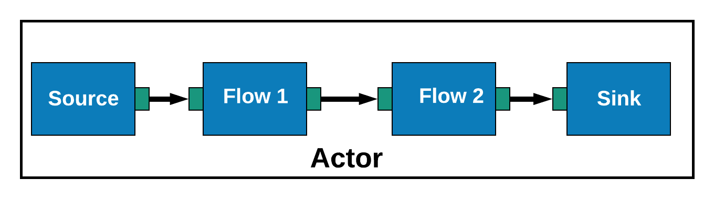
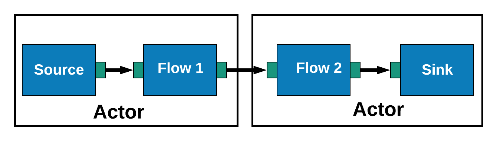
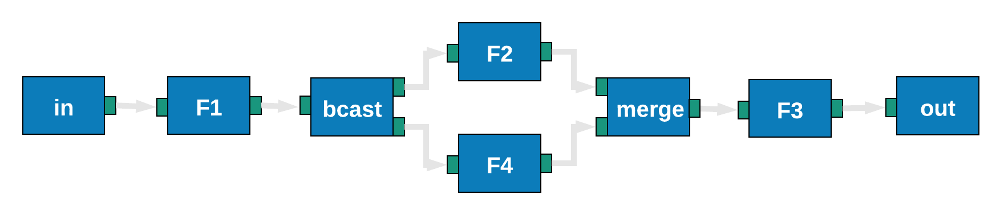

```scala
val graph = Flow.fromGraph(GraphDSL.create() {
  implicit builder =>
  import GraphDSL.Implicits._

  val bcast = builder.add(Broadcast[A](2))
  val merge = builder.add(Merge[B](2))

  val f2 = flowOfSomething
  val f3 = flowOfSomethingElse

  bcast.out(0) ~> f2 ~> merge
  bcast.out(1) ~> f3 ~> merge
  FlowShape(bcast.in, merge.out)
})
```

---

A Pathway to Graphs<br>A Bit More Than An Introduction To Akka Streams

---

- The fundamental parts of streams
- Common strategies of dealing with them
- The very beginning of Graphs

---?image=assets/img/gray.jpg&position=left&size=50% 100%

@snap[north-west text-16 text-bold span-50]
@color[#1a1a1a](Reactive Streams)
@snapend

@snap[west text-italic span-50]
&quot;Reactive Streams is a standard and specification for Stream-oriented libraries for the JVM that&quot;
@snapend

@snap[east text-white span-45]
@ul[spaced]
- process a potentially unbounded number of elements
- in sequence,
- asynchronously passing elements between components,
- with mandatory non-blocking backpressure.
@ulend
@snapend

+++

@snap[west text-10 span-45]
##### @color[#ff6600](Reactive Streams)
Is a specification of how to move data asynchronously without loss
@snapend

@snap[east text-10 span-45]
##### @color[#ff6600](Akka Streams)
Is an implementation of the Reactive Streams
@snapend

---

@snap[north text-16 text-bold span-100]
Stream
@snapend


+++

@snap[north text-16 text-bold span-100]
Graph
@snapend


+++

@snap[north text-16 text-bold span-100]
Graphs
@snapend

@ul[spaced]
- A graph is the definition of how the data will flow
- Each node in a graph is also a `Graph`
- A `Graph` is a `Shape` with predefined inlets and outlets
@ulend

+++

```scala
final class Source[+Out, +Mat](
  override val traversalBuilder: LinearTraversalBuilder,
  override val shape:            SourceShape[Out])
extends FlowOpsMat[Out, Mat] with Graph[SourceShape[Out], Mat] {
  // ...
}
```

---

@snap[north text-16 span-100]
Composition
@snapend

```scala
implicit val actorSystem = ActorSystem("composition")
implicit val materializer = ActorMaterializer()
implicit val executionContext = actorSystem.dispatcher

val source: Source[Int, NotUsed] = Source(aListOfInts)

val flow: Flow[Int, String, NotUsed] = Flow[Int]
  .map(i => s"transform $i into a string")

val sink: Sink[String, Future[Done]] =
  Sink.foreach(println)

val runnable: RunnableGraph[Future[Done]] =
  source.via(flow).toMat(sink)(Keep.right)

val result: Future[Done] = runnable.run()
result.onComplete(_ => actorSystem.terminate())
```

@[5-6]
@[7-9]
@[10-12]
@[13-15]
@[16-17]

---

@snap[north text-16 span-100]
Common Patterns
@snapend

```scala
Source(iterable)
  .map(_ => Future("OK Computer"))
  .to(aSink)
```

<hr>

```scala
Source(iterable)
  .mapAsync(2)(_ => Future("OK Computer"))
  .to(aSink)
```

<hr>

```scala
Source(iterable)
  .map(_ => Future("OK Computer"))
  .async
  .map(_ => Future("OK Computer"))
  .to(aSink)
```

+++

@snap[north text-16 span-100]
`map` vs `mapAsync` vs `async`
@snapend

```scala
// map
Source(List(1, 2, 3))
  .map(i => Future.successful(i))
  .runWith(Sink.foreach(println))
// prints Future(Success(1)) Future(Success(2)) Future(Success(3))

// mapAsync
Source(List(1, 2, 3))
  .mapAsync(2)(i => Future.successful(i))
  .runWith(Sink.foreach(println))
// prints 1 2 3

// async
Source(List(1, 2, 3))
  .map(i => Future.successful(i))
  .async
  .map(i => Future.successful(i))
  .runWith(Sink.foreach(println))
// prints:
//Future(Success(Future(Success(1))))
//Future(Success(Future(Success(2))))
//Future(Success(Future(Success(3))))
```

@[1-6]
@[7-12]
@[13-22]
@[1-22]

+++





+++

@snap[north text-16 span-100]
`mapAsyncUnordered`
@snapend

- `mapAsyncUnordered` emits data as soon as the `Future` completes
- `mapAsync` keeps the order in which data comes in

```scala
Source(data)
  .mapAsyncUnordered(parallelism)(a network call)
  .runWith(aSink)
```

---

@snap[north text-16 span-100]
Batching
@snapend

```scala
Source(data)
  .map(x => hydrate(x))
  .groupedWithin(sizeOfGroup, timeLimit)
  .mapAsync(parallelism)(group => batchOperation(group))
  .runWith(aSink)
```

---

@snap[north text-16 span-100]
Decomposition
@snapend

```scala
Source(data)
  .map(x => getGroupsOfResultsFor(x))
  .mapConcat(processOneElementAtATime)
  .runWith(aSink)
```

+++

```scala
// groupedWithin
Source(List(1, 2, 3, 4))
  .groupedWithin(2, 1 second)
  .runWith(Sink.seq)
// Vector(1, 2)
// Vector(3, 4)

Source(List(1, 2, 3, 4))
  .grouped(2)
  .mapConcat(identity)
  .runWith(Sink.seq)
// Vector(1, 2, 3, 4)
```

@[1-7]
@[8-12]

---

@snap[north text-16 span-100]
Handling Exceptions
@snapend

```scala
Source(1 to 5)
  .map(i => if (i % 2 == 0) i / 0 else i)
  .runWith(aSink)
// terminates after 1
// Future.failed

Source(ints)
  .map(i => if (i % 2 == 0) i / 0 else i)
  .recover { case e => throw e }
  .runWith(aSink)
// terminates after 1 AND we can see the logged ex
// Future.failed
```

@[1-6]
@[7-12]

+++

@snap[north text-16 span-100]
Handling Exceptions &mdash; Strategies
@snapend

- `RestartSource`
- `recover`
- `recoverWithRetries`
- Supervision Strategy
- Killswitch

+++

@snap[north text-16 span-100]
`RestartSource`
@snapend

```scala
val restartable = RestartSource.withBackoff(
  minBackoff = 10 milliseconds,
  maxBackoff = 3 seconds,
  randomFactor = 0.2,
  maxRestarts = 10
) { () =>
  Source(data)
    .mapAsync(4)(d => succeedOrFailWith(d))
    .mapAsync(4)(x => someOtherFutureCall(x))
    .map(process)
}

restartable.runWith(Sink.seq)
```

+++

```scala
def getRestartable(x: Data) = RestartSource
  .withBackoff(
    10 milliseconds, 3 seconds, 0.2, 10
  ) { () =>
    val response = succeedOrFailWith(x)
    Source.fromFuture(response)
      .mapAsync(1)(d => someOtherFutureCall(d))
  }
  .runWith(Sink.seq) // get the Future returned by Sink.seq

Source(data)
  .mapAsync(4)(x => getRestartable(x))
  .runWith(Sink.seq)
```

---

@snap[north text-16 span-100]
Graphs
@snapend

```scala
// Do not do it at home
val graph = RunnableGraph.fromGraph(GraphDSL.create() {
  implicit builder =>
  import GraphDSL.Implicits._

  val source = Source(data)
  val flow = Flow[T].map(x => doSomething(x))
  val sink = Sink.ignore

  // source.via(flow).to(sink)
  source ~> flow ~> sink
  ClosedShape
})
```

+++

@snap[north text-16 span-100]
Graphs
@snapend


```scala
source ~> flow ~> sink
```

+++

@snap[north text-16 span-100]
Graphs
@snapend

```scala
val sink = Flow[Int].map(identity)
  .toMat(Sink.fold(0)((a, b) => a + b))(Keep.right)

val graph: RunnableGraph[Future[Int]] = RunnableGraph
  .fromGraph(GraphDSL.create(sink) {
    implicit builder => out =>
    import GraphDSL.Implicits._
    val in = Source(1 to 10)

    val bcast = builder.add(Broadcast[Int](2))
    val merge = builder.add(Merge[Int](2))

    val f1, f2, f3, f4 = Flow[Int].map(_ + 10)

    in ~> f1 ~> bcast ~> f2 ~> merge ~> f3 ~> out
                bcast ~> f4 ~> merge
    ClosedShape
  })
})

graph.run()
// Future(Success(710))
```

+++



```scala
in ~> f1 ~> bcast ~> f2 ~> merge ~> f3 ~> out
            bcast ~> f4 ~> merge
```

---

```scala
val graph = Flow.fromGraph(GraphDSL.create() {
  implicit builder =>
  import GraphDSL.Implicits._

  val bcast = builder.add(Broadcast[A](2))
  val merge = builder.add(Merge[B](2))

  val f2 = flowOfSomething
  val f3 = flowOfSomethingElse

  bcast ~> f2 ~> merge
  bcast ~> f3 ~> merge
  FlowShape(bcast.in, merge.out)
})
```

---

@snap[north text-16 span-100]
Recap
@snapend

- Each part of a stream is a `Graph`
- A stream/graph runs only when all components are connected
- `map` vs `mapAsync` vs `mapAsyncUnordered` vs `async`
- batching and decomposing data
- composing streams and its parts
- GraphDSL

---

@snap[north text-16 span-100]
Useful Resources
@snapend

- Documentation
- Akka in Action (Streams chapter)
- edX course: Programming Reactive Systems

